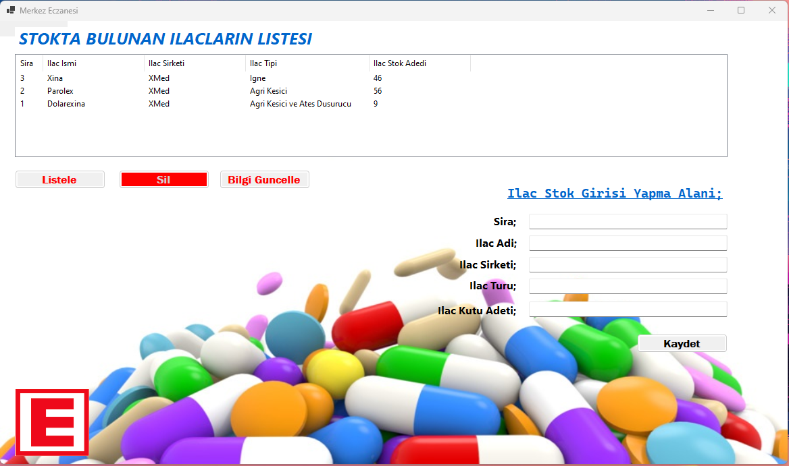

# Eczane İlaç Stok Yönetim Sistemi

> Bu, eczanelerin ilaç stoklarını yönetmelerine yardımcı olan bir C# Windows Forms uygulamasıdır. Bu uygulama ile bir eczane stokunu yönetebilir, ilaç ekleyebilir, ilaç stokunu listeleyebilir, ilaç detaylarını güncelleyebilir ve ilaç silebilir.

---

## Açıklama

Bu proje, eczanelerin ilaç stoklarını verimli bir şekilde yönetmelerine yardımcı olmak amacıyla tasarlanmıştır. İlaç eklemek, listelemek, güncellemek ve silmek için kullanıcı dostu bir arayüz sunar.

---

## Özellikler

- Yeni ilaçları stoka ekleyebilme.
- İlaçları ilaç adı, şirket, tip ve stok miktarı gibi detaylarla listeleyebilme.
- İlaç adı, şirket, tip ve stok miktarı gibi ilaç detaylarını güncelleme.
- İlaçları stoktan kaldırabilme.

---

## Kurulum

1. Bu depoyu yerel makinenize klonlayın.
2. Projeyi Visual Studio'da açın.
3. Uygulamayı derleyin ve çalıştırın.

---

## Kullanım

- Uygulamayı başlatın.
- Arayüzü kullanarak ilaç ekleyin, güncelleyin, listeleyin veya kaldırın.
- İlaçların detayları ile birlikte listesini görüntüleyin.

---ENGLISH---

# Pharmacy Medicine Stock Management System

> This is a C# Windows Forms application that provides a user interface for pharmacy medicine stock management. With this application, a pharmacy can maintain its stock, add medicines, list medicine stock, update medicine details, and remove medicines.

---

## Description

This project is designed to help pharmacies manage their medicine stocks efficiently. It offers a user-friendly interface for adding, listing, updating, and removing medicines from the stock.

---

## Features

- Add new medicines to the stock.
- List medicines with details including medicine name, company, type, and stock quantity.
- Update medicine details such as name, company, type, and stock quantity.
- Remove medicines from the stock.

---

## Installation

1. Clone this repository to your local machine.
2. Open the project in Visual Studio.
3. Build and run the application.

---

## Usage

- Launch the application.
- Use the interface to add, update, list, or remove medicines from the stock.
- View the list of medicines along with their details.
